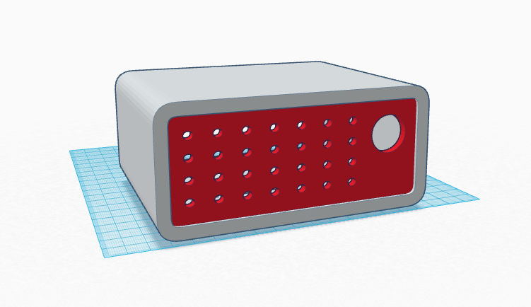
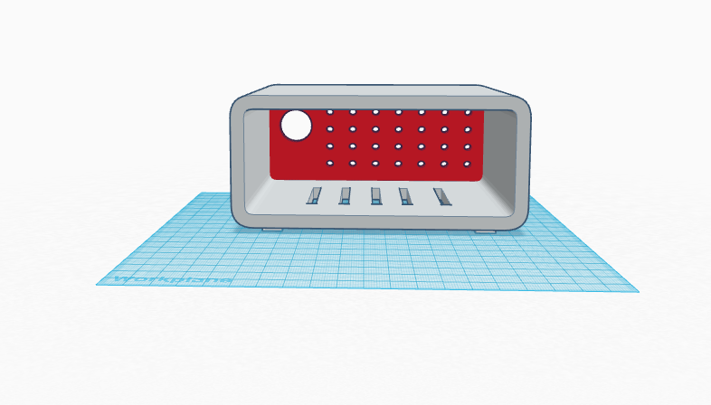

# Lila

Lila is a Raspberry Pi based smart alarm clock designed for personal use. 

*currently under development.*

###Functions:

* [ ] Set an alarm via the web app
* [ ] Alarm goes off in the morning 
* [ ] Hue lights are turned on
* [ ] Says "Good morning" and begins to read you the weather / news of the day

###Design:

Hardware concept for the casing:

